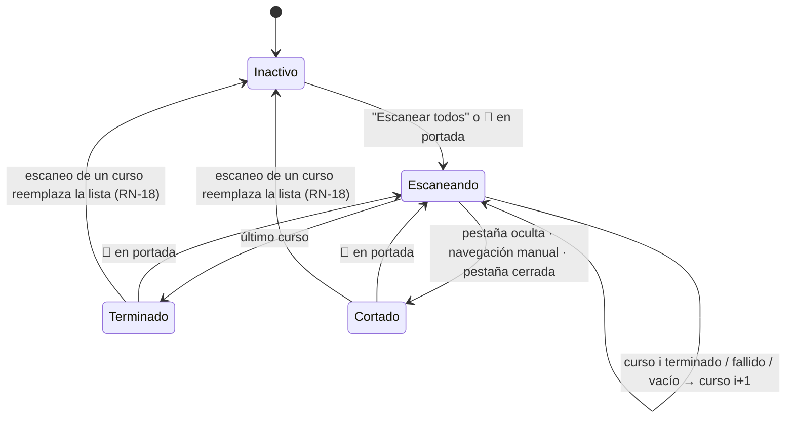

# Classroom: escanear todos los cursos desde la portada

**Estado**: `draft` — RN-2 y NFR-1 dependen de **M-1** y **M-2** (§Mediciones pendientes). M-3 cerrado.
**Fecha**: 2026-09-25
**Traza de decisiones**: [`assumptions.md`](./assumptions.md)
**Diseño del portal**: [`../../portal-google-classroom-diseno.md`](../../portal-google-classroom-diseno.md) (D1–D13)

> ⚠️ **Los 23 supuestos se aprobaron en bloque y sin leerlos** (el dueño, 2026-09-25: *"aprobado,
> sin leer"*). Ninguna regla de esta spec fue discutida. Antes de ejecutar el plan conviene que el
> dueño lea al menos las tres marcadas en §Las decisiones con más filo.

---

## Historia

> Como alumno, cuando estoy en la portada de Google Classroom ("Todas mis clases"), quiero que la
> extensión escanee todos mis cursos de una vez, para no tener que entrar curso por curso.

## Contexto y problema

El corte 1 (en `main` desde el 2026-09-25) escanea **un** curso: el de la pestaña. Con 8 cursos, el
dueño tiene que entrar a cada uno, abrir el popup, esperar entre 30 y 50 s con la pestaña al frente
y bajar. En la portada (`/u/<n>/h`) la extensión hoy no hace nada: `esPaginaDelSitio` sólo reclama
`/c/` y `/w/` (`sitio/google-classroom/config.ts:53-56`).

Lo que lo hace posible: el scraper navega **dentro de la SPA** con `click()` sobre links de `nav`
(`sitio/google-classroom/scraper.js:298`, `:501`, `:577`), así que un script inyectado sobrevive al
cambio de vista. Lo que lo complica: Classroom no pinta con la pestaña en segundo plano (diseño §8),
el recorrido entero dura minutos y hoy **cerrar el popup a mitad de escaneo descarta el resultado**
(`docs/TECHNICAL_DEBT.md`, ⚪ abierto).

Esta funcionalidad va antes que el destino en `~/U.N.L.P` (`docs/specs/classroom-destino/spec.md`)
y que el rediseño de la extensión, por orden del dueño.

## Alcance

**Incluye**
- Un recorrido que escanea, desde la portada, todos los cursos de la cuenta de la pestaña:
  activos y archivados.
- De cada curso, lo mismo que el escaneo de hoy: Trabajo en clase + Novedades (D11), con "Ver más"
  (D13) y la identidad del curso confirmada como en el corte 1.
- Una sola lista con el material de todos los cursos, agrupada por curso.
- Que el recorrido sobreviva a cerrar el popup.

**No incluye**
- Descargar solo. El recorrido termina en la lista; bajar es lo de hoy.
- El destino en `~/U.N.L.P` (corte 2, su propia spec). Cada curso baja a su carpeta actual.
- La presentación final de la lista multi-curso: la decide el rediseño.
- Arreglar "cerrar el popup descarta el resultado" para el escaneo de **un** curso (RN-19).
- Otras cuentas de Google abiertas en el navegador.

## Actores

| Actor | Puede |
|---|---|
| Dueño (único usuario, extensión personal) | Lanzar el recorrido, cerrar y reabrir el popup durante él, re-lanzarlo con 🔄, elegir qué bajar |
| Classroom (la pestaña) | Es el único lugar donde corre el escaneo; deja de pintar si pierde el frente |

## Reglas de negocio

**Disparo y alcance**
- **RN-1** — En la portada de Classroom (`/u/<n>/h` y sus vistas) el popup ofrece el botón
  **"Escanear todos los cursos"**. Abrir el popup ahí **no** escanea solo.
- **RN-2** — Entran todos los cursos de la cuenta `/u/<n>` de la pestaña: los activos y los
  archivados (`/u/<n>/h/archived`). *Depende de M-2: cómo se llega a los archivados desde la portada.*
- **RN-3** — De cada curso se escanea exactamente lo que escanea hoy el escaneo de un curso; el
  escaneo de un curso no cambia en nada (RN-19).
- **RN-4** — El recorrido termina en la lista. No encola ni descarga nada.

**Recorrido**
- **RN-5** — Los cursos se recorren **en la misma pestaña, uno tras otro**, nunca en paralelo ni en
  pestañas de fondo (Classroom no pinta en segundo plano).
- **RN-6** — Orden: el de la portada para los activos, y después los archivados en el orden de su
  página. (M-3: la portada trae los 6 activos completos, sin "Ver más".)
- **RN-7** — Cada curso conserva su tope actual de escaneo (`topeEscaneoMs`, 180 s). No hay tope
  global: el recorrido dura lo que sumen sus cursos.
- **RN-8** — Si un curso falla (identidad no confirmada, no cargó, superó su tope), **se saltea y el
  recorrido sigue**. El motivo queda registrado para el resumen (RN-17).
- **RN-9** — Si la pestaña pasa a segundo plano, o el dueño navega a mano fuera del recorrido, el
  recorrido **se corta**. Se conservan los cursos **ya completos**; el curso a medio escanear se
  descarta entero.
- **RN-10** — Al terminar o cortarse, la pestaña queda donde esté; volver a la portada es PA-1.

**Datos del resultado**
- **RN-11** — Cada ítem conserva la identidad del escaneo de un curso: su `modulo` lleva el curso,
  así que dos cursos nunca comparten clave (ADR-0014).
- **RN-12** — Un mismo archivo de Drive que esté en dos cursos aparece **dos veces**, una por curso.
- **RN-13** — Cada curso baja a su carpeta de hoy, `raíz/google-classroom/<curso>/`.
- **RN-14** — Los cursos sin material (hoy MC6 y Q5) no aparecen en la lista; sólo en el resumen.

**Persistencia y convivencia con la lista de un curso**
- **RN-15** — El progreso y el resultado del recorrido se guardan en storage a medida que avanza:
  cerrar el popup **no** corta el recorrido, y al reabrirlo se ve el progreso (si sigue) o el
  resultado (si terminó).
- **RN-16** — Mientras un recorrido está en curso en una pestaña, abrir el popup en esa pestaña
  **muestra el progreso y no dispara el escaneo del curso** en el que la pestaña esté parada en ese
  momento (ver §Tabla de decisión: ésta es la fila que el comportamiento de hoy rompería).
- **RN-17** — Al terminar (o cortarse) se muestra un resumen: cuántos cursos, cuántos con material,
  cuántos vacíos, cuántos fallidos, y el motivo de cada fallido.
- **RN-18** — La lista de todos **reemplaza** a la lista guardada (se guarda una sola, como hoy).
  Abrir después el popup dentro de un curso sin recorrido en curso se comporta como hoy: escanea ese
  curso y reemplaza la lista de todos.
- **RN-19** — El escaneo de un solo curso queda igual que en `main`, incluido que cerrar el popup
  lo descarte.
- **RN-20** — 🔄 en la portada vuelve a lanzar el recorrido completo.

**Aviso previo**
- **RN-21** — Antes de arrancar, el popup avisa la duración estimada y que la pestaña tiene que
  quedar al frente todo el recorrido. La estimación sale de M-1.

## Flujos

**Camino feliz**
1. El dueño abre Classroom en la portada y abre el popup.
2. El popup muestra "Escanear todos los cursos" con el aviso de RN-21.
3. El dueño lo aprieta. La pestaña recorre los 8 cursos; la tarjeta muestra "Curso 3 de 8: MC2 2025".
4. El dueño cierra el popup y espera. Lo reabre: ve el progreso.
5. Termina. El popup muestra el resumen y la lista agrupada por curso.
6. El dueño elige qué bajar, como hoy.

**Alternativos**

| # | Cuándo | Qué pasa |
|---|---|---|
| A1 | Un curso no confirma identidad o no carga | Se saltea (RN-8); aparece como fallido en el resumen con su motivo |
| A2 | Un curso no tiene material | No aparece en la lista; cuenta como vacío en el resumen (RN-14) |
| A3 | El dueño cambia de pestaña a mitad | Se corta (RN-9); resumen con los completos y "cortado: pestaña en segundo plano" |
| A4 | El dueño navega a mano a otro curso a mitad | Se corta (RN-9); igual que A3 con "cortado: navegaste fuera del recorrido" |
| A5 | El dueño cierra el popup a mitad | El recorrido sigue (RN-15) |
| A6 | Reabre el popup a mitad, con la pestaña parada en un curso | Ve el progreso; no se escanea ese curso (RN-16) |
| A7 | Cierra la pestaña de Classroom a mitad | El recorrido muere con la pestaña; se conservan los completos (RN-9) |
| A8 | Abre el popup en un curso, sin recorrido en curso | Comportamiento de hoy; reemplaza la lista de todos (RN-18) |
| A9 | Todos los cursos fallan o están vacíos | No hay lista; sólo el resumen |
| A10 | Backend caído | El recorrido funciona igual (escanear no usa el backend); bajar queda deshabilitado como hoy |

## Tabla de decisión — qué hace el popup al abrirse

Se evalúa en este orden; gana la primera fila que aplica.

| # | ¿Recorrido en curso en esta pestaña? | Página de la pestaña | ¿Lista guardada? | Resultado |
|---|---|---|---|---|
| 1 | Sí | cualquiera de Classroom | — | Progreso del recorrido (RN-16) |
| 2 | No | Portada | De todos | Muestra esa lista con su resumen |
| 3 | No | Portada | De un curso o ninguna | Botón "Escanear todos los cursos" (RN-1) |
| 4 | No | Curso | De ese curso | Como hoy: usa la guardada |
| 5 | No | Curso | De todos, u otro curso, o ninguna | Como hoy: escanea ese curso y reemplaza (RN-18) |

La fila 1 es la que **rompe** el comportamiento de hoy a propósito: durante el recorrido la pestaña
está parada en un curso, y la regla de hoy (fila 5) dispararía un segundo escaneo encima del primero.

## Diagrama de estados del recorrido



`Terminado` y `Cortado` tienen lista (los cursos completos) y resumen; sólo difieren en que
`Cortado` dice por qué se cortó y cuántos cursos quedaron sin recorrer.

## Datos

- **Progreso del recorrido** (storage, sobrevive al popup): pestaña, cuenta `/u/<n>`, estado
  (`escaneando` · `terminado` · `cortado`), lista de cursos a recorrer, índice actual, y por curso
  ya recorrido: `ok` con su cantidad de ítems · `vacío` · `fallido` con motivo. Motivo del corte si
  lo hubo.
- **Resultado**: los ítems de todos los cursos completos, con la misma forma que el escaneo de un
  curso, y el origen de la lista marcando que es "de todos" (no de un curso).
- **Retención**: hasta el próximo escaneo, de todos o de un curso (RN-18). Un solo resultado a la vez.

## Wireframes

**Estado base — portada, sin lista de todos**

```
┌──────────────────────────────────────────┐
│ Course Downloader      Google Classroom  │
├──────────────────────────────────────────┤
│                                          │
│  Estás en "Todas mis clases".            │
│                                          │
│  ┌────────────────────────────────────┐  │
│  │     Escanear todos los cursos      │  │
│  └────────────────────────────────────┘  │
│                                          │
│  Tarda unos 5 minutos (8 cursos).        │
│  Dejá esta pestaña al frente hasta que   │
│  termine. Podés cerrar este popup.       │
│                                          │
└──────────────────────────────────────────┘
```

**Escaneando** (sólo la región que cambia)

```
│  Escaneando curso 3 de 8                 │
│  MC2 2025                                │
│  ██████████░░░░░░░░░░░░░░░               │
│  Listos: 2 · Vacíos: 0 · Fallidos: 0     │
```

**Terminado** (resumen arriba de la lista)

```
│  8 cursos: 5 con material · 2 vacíos ·   │
│  1 fallido                               │
│  ⚠ MB5 2024: no pudimos confirmar el     │
│    curso                                 │
├──────────────────────────────────────────┤
│  ▾ Física II G22 2026 2C          63     │
│    ☐ Clase 7.pdf                         │
│    ☐ …                                   │
│  ▾ Física I-Grupo G-Ing 2024     130     │
│    ☐ …                                   │
```

**Cortado**

```
│  Se cortó en el curso 4 de 8: Classroom  │
│  quedó en segundo plano.                 │
│  Se guardaron los 3 cursos completos.    │
│  Dejá la pestaña al frente y 🔄.         │
```

## Criterios de aceptación

```gherkin
AC-1 — La portada ofrece el recorrido y no escanea sola
  Dado Classroom abierto en /u/2/h sin recorrido en curso ni lista de todos
  Cuando el dueño abre el popup
  Entonces ve el botón "Escanear todos los cursos" y el aviso de duración y pestaña al frente
    y la pestaña no se mueve

AC-2 — Recorrido completo
  Dado Classroom en /u/2/h con N cursos entre activos y archivados
  Cuando el dueño aprieta "Escanear todos los cursos" y deja la pestaña al frente
  Entonces el resumen cuenta los N cursos, sin fallidos
    y la lista trae un grupo por cada curso con material
    y el grupo de G25 trae 71 de Trabajo en clase y el de MB5 trae 24
  (N no se fija: MC4 1S 2026 desapareció de la portada entre el 12 y el 16-09; los únicos totales
  firmes son los de los archivados)

AC-3 — Lo de cada curso es igual que escanearlo solo
  Dado un recorrido terminado
  Cuando el dueño escanea MC2 2025 por separado
  Entonces MC2 trae los mismos ítems, con los mismos nombres, que tenía en el recorrido

AC-4 — Cerrar el popup no corta
  Dado un recorrido en el curso 2 de 8
  Cuando el dueño cierra el popup y lo reabre 60 s después
  Entonces ve el progreso en un curso posterior al 2
    y al terminar la lista está completa

AC-5 — Reabrir el popup a mitad no dispara un segundo escaneo
  Dado un recorrido en curso con la pestaña parada dentro de Física I-Grupo G-Ing 2024
  Cuando el dueño abre el popup
  Entonces ve el progreso del recorrido
    y no aparece "Escaneando la pestaña…" del escaneo de un curso

Esquema del escenario: AC-6 — El recorrido se corta y conserva lo completo
  Dado un recorrido que ya completó 3 cursos y está en el 4
  Cuando <evento>
  Entonces el recorrido se corta
    y la lista trae sólo los 3 cursos completos
    y el resumen dice "<motivo>" y que quedaron 5 sin recorrer

  Ejemplos:
    | evento                                        | motivo                                  |
    | el dueño cambia a otra pestaña                | Classroom quedó en segundo plano        |
    | el dueño hace click en otro curso del sidebar | navegaste fuera del recorrido           |

AC-7 — Un curso que falla no frena el resto
  Dado un recorrido en el que MB5 2024 no confirma su identidad
  Cuando el recorrido termina
  Entonces la lista trae los demás cursos con material
    y el resumen muestra "1 fallido" con "MB5 2024: no pudimos confirmar el curso"

AC-8 — Los cursos vacíos no ensucian la lista
  Dado un recorrido terminado
  Entonces MC6 y Q5 no tienen grupo en la lista
    y el resumen los cuenta como vacíos

AC-9 — Un archivo en dos cursos aparece dos veces
  Dado un archivo de Drive adjunto en dos cursos distintos
  Cuando el recorrido termina
  Entonces aparece una vez en el grupo de cada curso
    y bajarlo desde un grupo no lo marca como bajado en el otro

AC-10 — Cada curso baja a su carpeta
  Dado un recorrido terminado
  Cuando el dueño baja un PDF de G22 y uno de MC2
  Entonces quedan en raíz/google-classroom/<curso G22>/ y raíz/google-classroom/<curso MC2>/

AC-11 — Escanear un curso después reemplaza la lista de todos
  Dado un recorrido terminado y sin recorrido en curso
  Cuando el dueño entra a MC2 2025 y abre el popup
  Entonces escanea MC2 como hoy
    y al volver a la portada ve el botón "Escanear todos los cursos", no la lista de todos

AC-12 — 🔄 en la portada re-lanza el recorrido
  Dado Classroom en la portada con una lista de todos guardada
  Cuando el dueño aprieta 🔄
  Entonces arranca un recorrido nuevo desde el curso 1

AC-13 — El escaneo de un curso no cambió
  Dado Classroom dentro de Física II G22, sin recorrido en curso
  Cuando el dueño abre el popup
  Entonces el comportamiento es idéntico al de main al 2026-09-25 (escanea, o usa la lista guardada de G22)

AC-14 — Todo vacío o fallido
  Dado un recorrido en el que ningún curso trae material
  Cuando termina
  Entonces no hay lista y el resumen explica cuántos vacíos y cuántos fallidos hubo
```

## Requisitos no funcionales

- **NFR-1** — Los 8 cursos del dueño se recorren en **menos de 6 minutos** con la pestaña al frente.
  *Depende de M-1.*
- **NFR-2** — El recorrido no agrega esperas propias entre cursos más allá de las del escaneo de un
  curso y la navegación al siguiente.
- **NFR-3** — El escaneo sigue siendo DOM y SPA: nada de APIs internas de Classroom ni pestañas
  ocultas.
- **NFR-4** — Contenido scrapeado (nombres de curso en el resumen y los encabezados) se escapa como
  todo lo demás (`docs/security.md`).

## Mediciones pendientes

| M | Qué medir | Cómo | Qué decide |
|---|---|---|---|
| **M-1** | Cuánto tarda cada curso hoy, con la pestaña al frente | Cronometrar el escaneo de un curso en los 8, en Brave, con el build de `main` | Si la suma pasa de 6 min, NFR-1 se relaja al valor medido + 20 % y el aviso de RN-21 usa ese número |
| **M-2** | Cómo se llega a los archivados desde la portada sin recargar | En Brave, desde `/u/2/h`: ¿hay link en `nav` a `/h/archived`? ¿el click navega en la SPA o recarga? | Si navega en la SPA, un solo script inyectado recorre todo. Si recarga, el script muere y el recorrido necesita re-inyectarse por curso (lo resuelve el plan, no cambia ninguna regla) |
| ~~M-3~~ ✅ | Si la portada entrega todos los cursos activos | Medido 2026-09-25 sobre `docs/muestras/google-classroom/recorrido-3/`: `00-partida.html` tiene **6** ids `/u/2/c/<id>` distintos (los 6 activos de M2), 0 "Ver más", y un link a `/h/archived`; `00-archivadas.html` tiene **8** (los 6 activos, por el sidebar, + G25 y MB5) | RN-6 queda firme. Dato para el plan: la página de archivadas sola ya enumera los 8 |

M-1 y M-2 necesitan al dueño en Brave. Para M-2, el link a `/h/archived` **existe** en la portada
(M-3); falta saber si el click navega en la SPA o recarga.

## Supuestos resueltos

Los 23 supuestos de `assumptions.md` quedaron **aprobados tal cual, sin lectura del dueño**. No hay
supuesto que haya cambiado de definición; la tabla de trazabilidad supuesto → regla está en
`assumptions.md`.

## Las decisiones con más filo

1. **RN-15 (sobrevivir al popup)**: obliga a que el recorrido y su resultado vivan fuera del popup,
   el mismo problema que la deuda ⚪ "cerrar el popup descarta el resultado", pero resuelto sólo
   para el recorrido (RN-19 lo deja igual para un curso). Es la parte cara del plan.
2. **RN-16 y la fila 1 de la tabla de decisión**: rompen a propósito el disparo automático de hoy.
   Si se implementa mal, abrir el popup a mitad del recorrido lanza un segundo escaneo sobre la misma
   pestaña.
3. **RN-18 (una sola lista)**: entrar a un curso y abrir el popup tira la lista de todos. Es coherente
   con hoy, pero puede molestar si el dueño alterna entre la portada y un curso.

## Preguntas abiertas

- **PA-1** — Al terminar el recorrido, ¿la pestaña vuelve a la portada o queda en el último curso?
  No bloquea: sin decisión, queda donde está (RN-10).
- **PA-2** — Cuando llegue el corte 2 (destino en `~/U.N.L.P`), RN-13 se reemplaza por sus reglas.
  Ninguna de esta spec debería contradecirlas; revisar al aprobar aquella.
